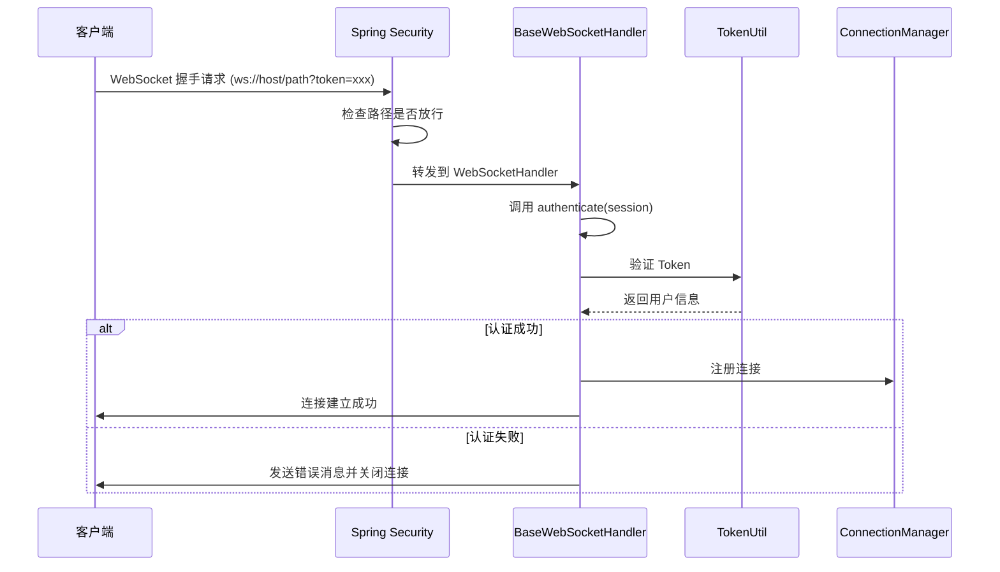

# WebSocket 组件使用规范

## 核心原则

**WebSocket 组件提供基础设施和抽象类，下游模块通过继承和实现接口来扩展 WebSocket 功能。所有 WebSocket 连接必须通过 Token 认证，认证失败将关闭连接。**

## 模块概述

### 上游模块：backend-common-websocket

**模块职责：**
- 提供 WebSocket 基础设施和配置
- 提供接口和抽象类供下游扩展
- 管理 WebSocket 连接和订阅关系
- 支持 Token 认证
- 提供消息推送服务接口

**核心组件：**
- `BaseWebSocketHandler` - 基础 WebSocket 处理器（抽象类）
- `WebSocketPushService` - 消息推送服务接口
- `WebSocketConnectionManager` - 连接管理器
- `WebSocketHandlerRegistry` - 处理器注册表
- `@WebSocketHandler` - 处理器注册注解

## 连接建立流程

### 1. 连接建立步骤



### 2. 认证机制

**认证流程：**
1. 客户端在 WebSocket 连接 URL 中传递 Token：`ws://host/path?token=xxx`
2. `BaseWebSocketHandler` 调用 `authenticate(session)` 方法
3. 子类实现从 URL 查询参数提取 Token
4. 使用 `TokenUtil.getUserByToken()` 验证 Token
5. 检查用户状态（必须为 ENABLED）
6. 认证失败则关闭连接

**安全性：**
- ✅ 不是任何人都可以建立连接
- ✅ 必须提供有效的 Token
- ✅ 用户状态必须为 ENABLED
- ✅ 认证失败会立即关闭连接

## 下游模块使用方式

### 步骤 1：实现 WebSocketPushService 接口

**文件：** `backend-custom-{业务名}/src/main/java/org/charno/custom/{业务名}/websocket/{业务名}MessagePushService.java`

```java
package org.charno.custom.wechatcustomer.websocket;

import com.fasterxml.jackson.databind.ObjectMapper;
import lombok.RequiredArgsConstructor;
import lombok.extern.slf4j.Slf4j;
import manager.org.charno.common.websocket.WebSocketConnectionManager;
import service.org.charno.common.websocket.WebSocketPushService;
import org.springframework.stereotype.Service;
import reactor.core.publisher.Mono;

/**
 * 微信客服消息推送服务
 * 实现 WebSocketPushService 接口，提供消息推送逻辑
 */
@Slf4j
@Service
@RequiredArgsConstructor
public class WechatMessagePushService implements WebSocketPushService {
    
    private final WebSocketConnectionManager connectionManager;
    private final ObjectMapper objectMapper;
    
    @Override
    public Mono<Void> pushMessage(String subscriptionKey, Object message) {
        try {
            // 将消息对象序列化为 JSON
            String jsonMessage = objectMapper.writeValueAsString(message);
            
            // 通过连接管理器推送消息给订阅者
            return connectionManager.sendToSubscribers(subscriptionKey, jsonMessage)
                    .doOnSuccess(v -> log.debug("推送消息成功: subscriptionKey={}", subscriptionKey))
                    .doOnError(e -> log.error("推送消息失败: subscriptionKey={}", subscriptionKey, e));
        } catch (Exception e) {
            log.error("序列化消息失败: subscriptionKey={}", subscriptionKey, e);
            return Mono.error(e);
        }
    }
    
    @Override
    public String getMessageType() {
        return "wechat_message";
    }
}
```

### 步骤 2：实现 WebSocketHandler

**文件：** `backend-custom-{业务名}/src/main/java/org/charno/custom/{业务名}/websocket/{业务名}MessageWebSocketHandler.java`

```java
package org.charno.custom.wechatcustomer.websocket;

import com.fasterxml.jackson.databind.ObjectMapper;
import lombok.extern.slf4j.Slf4j;
import annotation.org.charno.common.websocket.WebSocketHandler;
import handler.org.charno.common.websocket.BaseWebSocketHandler;
import manager.org.charno.common.websocket.WebSocketConnectionManager;
import service.org.charno.common.websocket.WebSocketPushService;
import util.org.charno.common.security.TokenUtil;
import org.charno.systementity.entity.SysUser;
import org.springframework.stereotype.Component;
import org.springframework.web.reactive.socket.WebSocketSession;
import reactor.core.publisher.Mono;

/**
 * 微信客服消息 WebSocket 处理器
 * 继承 BaseWebSocketHandler，实现业务特定的消息处理逻辑
 */
@Slf4j
@Component
@WebSocketHandler(path = "/ws/wechat/messages")
public class WechatMessageWebSocketHandler extends BaseWebSocketHandler {
    
    private final TokenUtil tokenUtil;
    
    public WechatMessageWebSocketHandler(
            WebSocketPushService pushService,
            WebSocketConnectionManager connectionManager,
            ObjectMapper objectMapper,
            TokenUtil tokenUtil) {
        super(pushService, connectionManager, objectMapper);
        this.tokenUtil = tokenUtil;
    }
    
    /**
     * 验证 Token
     * 从 URL 查询参数提取 Token，使用 TokenUtil 验证
     */
    @Override
    protected Mono<String> authenticate(WebSocketSession session) {
        // 从 URL 查询参数提取 Token
        String token = extractTokenFromUri(session.getHandshakeInfo().getUri());
        
        if (token == null || token.isEmpty()) {
            log.warn("WebSocket连接缺少Token: sessionId={}", session.getId());
            return Mono.empty();
        }
        
        // 使用 TokenUtil 验证 Token 并获取用户信息
        return tokenUtil.getUserByToken(token)
                .flatMap(user -> {
                    // 检查用户状态，只有 ENABLED 状态的用户才能连接
                    if (user.getStatus() != null && "ENABLED".equals(user.getStatus())) {
                        return Mono.just(user.getId().toString());
                    } else {
                        log.warn("用户状态异常，无法建立WebSocket连接: userId={}, status={}", 
                                user.getId(), user.getStatus());
                        return Mono.empty();
                    }
                })
                .switchIfEmpty(Mono.empty());
    }
    
    /**
     * 处理订阅
     * subscriptionKey 格式由业务定义，如：userId_externalUserid
     */
    @Override
    protected Mono<Void> handleSubscribe(String userId, String subscriptionKey, WebSocketSession session) {
        // 订阅逻辑：将用户添加到订阅关系
        return connectionManager.subscribe(userId, subscriptionKey);
    }
    
    /**
     * 处理取消订阅
     */
    @Override
    protected Mono<Void> handleUnsubscribe(String userId, String subscriptionKey) {
        // 取消订阅逻辑：从订阅关系中移除用户
        return connectionManager.unsubscribe(userId, subscriptionKey);
    }
}
```

### 步骤 3：注册 WebSocket 路径为放行路径

**文件：** `backend-custom-{业务名}/src/main/java/org/charno/custom/{业务名}/config/{业务名}SecurityPathProvider.java`

```java
package org.charno.custom.wechatcustomer.config;

import config.org.charno.common.security.PermitAllPathProvider;
import org.springframework.stereotype.Component;

import java.util.Arrays;
import java.util.List;

/**
 * 微信客服模块安全路径提供者
 * 注册需要放行的 WebSocket 路径
 * 
 * 注意：WebSocket 路径需要放行，但认证在 WebSocketHandler 中进行
 */
@Component
public class WechatSecurityPathProvider implements PermitAllPathProvider {
    
    @Override
    public List<String> getPermitAllPaths() {
        return Arrays.asList(
            "/ws/wechat/messages"  // WebSocket 路径需要放行
        );
    }
}
```

### 步骤 4：在业务逻辑中推送消息

**示例：在保存消息后推送**

```java
@Service
@RequiredArgsConstructor
public class WechatCustomerMessageService {
    
    private final WechatMessagePushService pushService;
    
    public Mono<Void> saveAndPushMessage(WechatCustomerMessage message) {
        // 1. 保存消息到数据库
        return messageRepository.save(message)
                .flatMap(savedMessage -> {
                    // 2. 构建订阅键（格式：userId_externalUserid）
                    String subscriptionKey = "user_" + savedMessage.getExternalUserid();
                    
                    // 3. 推送消息给订阅者
                    return pushService.pushMessage(subscriptionKey, savedMessage)
                            .doOnSuccess(v -> log.info("消息推送成功: messageId={}, subscriptionKey={}", 
                                    savedMessage.getId(), subscriptionKey))
                            .doOnError(e -> log.error("消息推送失败: messageId={}, subscriptionKey={}", 
                                    savedMessage.getId(), subscriptionKey, e));
                });
    }
}
```

## 消息格式规范

### 标准消息结构

**WebSocketMessage 类：**

```java
{
    "type": "SUBSCRIBE" | "UNSUBSCRIBE" | "PING" | "PONG" | "MESSAGE" | "ERROR",
    "key": "订阅键（用于订阅/取消订阅）",
    "data": "业务数据（任意对象）",
    "timestamp": "2024-01-01T00:00:00Z",
    "error": "错误信息（当 type 为 ERROR 时使用）"
}
```

### 消息类型

| 类型 | 说明 | 使用场景 |
|------|------|----------|
| `SUBSCRIBE` | 订阅消息 | 客户端订阅某个订阅键 |
| `UNSUBSCRIBE` | 取消订阅 | 客户端取消订阅 |
| `PING` | 心跳请求 | 客户端发送心跳 |
| `PONG` | 心跳响应 | 服务器响应心跳 |
| `MESSAGE` | 业务消息 | 服务器推送业务消息 |
| `ERROR` | 错误消息 | 服务器发送错误信息 |

### 订阅消息示例

**客户端发送订阅消息：**

```json
{
    "type": "SUBSCRIBE",
    "key": "user_externalUserid123"
}
```

**服务器响应：**

```json
{
    "type": "MESSAGE",
    "data": "Subscribed to user_externalUserid123",
    "timestamp": "2024-01-01T00:00:00Z"
}
```

### 业务消息推送示例

**服务器推送业务消息：**

```json
{
    "type": "MESSAGE",
    "data": {
        "id": "message-id",
        "content": "消息内容",
        "sender": "发送者",
        "timestamp": "2024-01-01T00:00:00Z"
    },
    "timestamp": "2024-01-01T00:00:00Z"
}
```

## 依赖配置

### pom.xml 依赖

下游模块需要在 `pom.xml` 中添加依赖：

```xml
<dependency>
    <groupId>org.charno</groupId>
    <artifactId>backend-common-websocket</artifactId>
    <version>0.0.1-SNAPSHOT</version>
</dependency>

<dependency>
    <groupId>org.charno</groupId>
    <artifactId>backend-common-security</artifactId>
    <version>0.0.1-SNAPSHOT</version>
</dependency>
```

## 心跳机制

### 默认行为

`BaseWebSocketHandler` 默认启用心跳机制：
- 客户端发送 `PING` 消息
- 服务器自动响应 `PONG` 消息

### 禁用心跳

如果子类需要禁用心跳，可以重写 `enableHeartbeat()` 方法：

```java
@Override
protected boolean enableHeartbeat() {
    return false;  // 禁用心跳
}
```

## 订阅键规范

### 订阅键格式

订阅键用于标识订阅关系，格式由业务模块定义。建议格式：

- **用户相关**：`user_{userId}`
- **业务相关**：`{业务名}_{业务ID}`
- **组合格式**：`user_{userId}_{业务ID}`

**示例：**
- `user_123` - 用户 123 的所有消息
- `wechat_externalUserid123` - 微信客服 externalUserid123 的消息
- `user_123_wechat_externalUserid123` - 用户 123 的微信客服消息

### 订阅键使用

1. **客户端订阅**：发送 `SUBSCRIBE` 消息，指定 `key` 字段
2. **服务器推送**：调用 `pushService.pushMessage(subscriptionKey, message)`
3. **客户端取消订阅**：发送 `UNSUBSCRIBE` 消息，指定 `key` 字段

## 前端集成

### 推荐方式：使用 WebSocketClient 工具类

项目提供了 `WebSocketClient` 工具类（位于 `src/utils/websocket.ts`），封装了 WebSocket 连接、订阅、心跳、重连等功能，推荐使用。

#### 基本使用

```typescript
import { WebSocketClient } from '@/utils/websocket';

// 创建 WebSocket 客户端实例
const wsClient = new WebSocketClient({
  url: 'ws://localhost:8080/ws/wechat/messages',
  token: localStorage.getItem('token') || '',
  enableHeartbeat: true,  // 默认启用，每30秒发送心跳
  heartbeatInterval: 30000,  // 心跳间隔（毫秒）
  reconnectInterval: 3000,  // 重连间隔（毫秒）
  maxReconnectAttempts: 5,  // 最大重连次数
  onOpen: () => {
    console.log('WebSocket 连接成功');
    
    // 连接成功后订阅消息
    wsClient.subscribe('user_externalUserid123');
  },
  onMessage: (message) => {
    if (message.type === 'MESSAGE') {
      // 处理业务消息
      console.log('收到消息:', message.data);
    } else if (message.type === 'ERROR') {
      // 处理错误
      console.error('错误:', message.error);
    }
  },
  onClose: () => {
    console.log('WebSocket 连接关闭');
  },
  onError: (error) => {
    console.error('WebSocket 错误:', error);
  },
});

// 连接 WebSocket
wsClient.connect();

// 订阅消息
wsClient.subscribe('user_externalUserid123');

// 取消订阅
wsClient.unsubscribe('user_externalUserid123');

// 检查连接状态
if (wsClient.isConnected()) {
  console.log('WebSocket 已连接');
}

// 获取连接状态
const status = wsClient.getStatus(); // 'connecting' | 'connected' | 'disconnected' | 'error'

// 获取所有订阅
const subscriptions = wsClient.getSubscriptions();

// 断开连接
wsClient.disconnect();
```

#### React 组件中使用示例

```typescript
import { useEffect, useRef } from 'react';
import { WebSocketClient } from '@/utils/websocket';

function MessageList() {
  const wsClientRef = useRef<WebSocketClient | null>(null);

  useEffect(() => {
    const token = localStorage.getItem('token');
    if (!token) return;

    // 创建 WebSocket 客户端
    wsClientRef.current = new WebSocketClient({
      url: 'ws://localhost:8080/ws/wechat/messages',
      token,
      onMessage: (message) => {
        if (message.type === 'MESSAGE') {
          // 处理业务消息，更新 UI
          console.log('收到新消息:', message.data);
        }
      },
      onError: (error) => {
        console.error('WebSocket 错误:', error);
      },
    });

    // 连接并订阅
    wsClientRef.current.connect();
    wsClientRef.current.subscribe('user_externalUserid123');

    // 清理：断开连接
    return () => {
      wsClientRef.current?.disconnect();
    };
  }, []);

  return <div>消息列表</div>;
}
```

#### WebSocketClient API

**构造函数选项：**

| 选项 | 类型 | 必填 | 默认值 | 说明 |
|------|------|------|--------|------|
| `url` | `string` | ✅ | - | WebSocket URL（不包含 token） |
| `token` | `string` | ✅ | - | 认证 Token |
| `onOpen` | `() => void` | ❌ | - | 连接成功回调 |
| `onClose` | `() => void` | ❌ | - | 连接关闭回调 |
| `onError` | `(error: Event) => void` | ❌ | - | 错误回调 |
| `onMessage` | `(message: WebSocketMessage) => void` | ❌ | - | 消息回调 |
| `enableHeartbeat` | `boolean` | ❌ | `true` | 是否启用心跳 |
| `heartbeatInterval` | `number` | ❌ | `30000` | 心跳间隔（毫秒） |
| `reconnectInterval` | `number` | ❌ | `3000` | 重连间隔（毫秒） |
| `maxReconnectAttempts` | `number` | ❌ | `5` | 最大重连次数 |

**方法：**

| 方法 | 说明 |
|------|------|
| `connect()` | 连接 WebSocket |
| `disconnect()` | 断开连接 |
| `subscribe(key: string)` | 订阅消息（key 为订阅键） |
| `unsubscribe(key: string)` | 取消订阅 |
| `isConnected()` | 检查是否已连接 |
| `getStatus()` | 获取连接状态 |
| `getSubscriptions()` | 获取所有订阅键 |

**特性：**

- ✅ **自动重连**：连接断开后自动重连，最多重试 5 次
- ✅ **自动心跳**：默认每 30 秒发送心跳，保持连接活跃
- ✅ **订阅管理**：自动管理订阅关系，重连后自动重新订阅
- ✅ **状态管理**：提供连接状态查询
- ✅ **错误处理**：统一的错误处理机制

### 原生 WebSocket 使用方式（不推荐）

如果需要使用原生 WebSocket API，可以参考以下示例：

```typescript
// 连接 WebSocket（需要传递 Token）
const token = localStorage.getItem('token');
const ws = new WebSocket(`ws://localhost:8080/ws/wechat/messages?token=${token}`);

// 连接成功
ws.onopen = () => {
    console.log('WebSocket 连接成功');
    
    // 订阅消息
    ws.send(JSON.stringify({
        type: 'SUBSCRIBE',
        key: 'user_externalUserid123'
    }));
};

// 接收消息
ws.onmessage = (event) => {
    const message = JSON.parse(event.data);
    
    if (message.type === 'MESSAGE') {
        // 处理业务消息
        console.log('收到消息:', message.data);
    } else if (message.type === 'ERROR') {
        // 处理错误
        console.error('错误:', message.error);
    }
};

// 连接关闭
ws.onclose = () => {
    console.log('WebSocket 连接关闭');
};

// 错误处理
ws.onerror = (error) => {
    console.error('WebSocket 错误:', error);
};

// 心跳处理（需要手动实现）
const heartbeatInterval = setInterval(() => {
    if (ws.readyState === WebSocket.OPEN) {
        ws.send(JSON.stringify({
            type: 'PING',
            timestamp: new Date().toISOString()
        }));
    }
}, 30000);  // 每30秒发送一次

// 清理心跳
ws.onclose = () => {
    clearInterval(heartbeatInterval);
};
```

**注意：** 使用原生 WebSocket 需要手动实现重连、心跳、订阅管理等功能，建议使用 `WebSocketClient` 工具类。

## 注意事项

### 1. 路径注册

**必须通过 `PermitAllPathProvider` 注册 WebSocket 路径：**
- WebSocket 握手请求会被 Spring Security 拦截
- 路径必须注册为放行路径
- 但认证在 `BaseWebSocketHandler` 中进行

### 2. Token 传递

**Token 必须通过 URL 查询参数传递：**
- 格式：`ws://host/path?token=xxx`
- 不支持通过请求头传递（WebSocket 握手阶段限制）

### 3. 认证失败处理

**认证失败会立即关闭连接：**
- 如果 `authenticate()` 返回空 Mono 或空字符串，连接会被关闭
- 客户端会收到错误消息：`{"type":"ERROR","error":"Authentication failed"}`

### 4. 用户状态检查

**必须检查用户状态：**
- 只有 `ENABLED` 状态的用户才能建立连接
- 其他状态的用户连接会被拒绝

### 5. 连接管理

**连接管理器自动处理：**
- 同一用户多次连接时，旧连接会被关闭
- 连接断开时自动清理订阅关系
- 无需手动管理连接生命周期

### 6. 消息序列化

**使用 ObjectMapper 序列化消息：**
- 推送消息时，对象会被序列化为 JSON 字符串
- 确保消息对象可被 Jackson 序列化

## ❌ 禁止事项

1. **禁止在 authenticate() 中返回固定值**
   ```java
   // ❌ 错误：任何人都可以连接
   @Override
   protected Mono<String> authenticate(WebSocketSession session) {
       return Mono.just("anonymous");
   }
   ```

2. **禁止跳过 Token 验证**
   ```java
   // ❌ 错误：未验证 Token
   @Override
   protected Mono<String> authenticate(WebSocketSession session) {
       return Mono.just("user123");  // 未验证 Token
   }
   ```

3. **禁止忘记注册路径放行**
   ```java
   // ❌ 错误：未注册路径，连接会被 Spring Security 拦截
   // 必须在 PermitAllPathProvider 中注册路径
   ```

4. **禁止在推送消息时直接操作连接**
   ```java
   // ❌ 错误：应该通过 WebSocketPushService 推送
   // 不要直接操作 WebSocketConnectionManager
   ```

## ✅ 检查清单

创建新的 WebSocket 处理器时，请检查：

- [ ] 实现了 `WebSocketPushService` 接口
- [ ] 继承了 `BaseWebSocketHandler` 并实现了所有抽象方法
- [ ] 使用 `@WebSocketHandler(path = "/ws/xxx")` 注解标记处理器
- [ ] 实现了 `authenticate()` 方法，使用 `TokenUtil` 验证 Token
- [ ] 检查了用户状态（必须为 ENABLED）
- [ ] 实现了 `handleSubscribe()` 和 `handleUnsubscribe()` 方法
- [ ] 通过 `PermitAllPathProvider` 注册了 WebSocket 路径
- [ ] 在业务逻辑中正确调用 `pushService.pushMessage()` 推送消息
- [ ] 订阅键格式符合业务规范
- [ ] 添加了适当的日志记录

## 常见问题

### Q1: WebSocket 连接被拒绝，返回 401 错误

**A:** 检查以下几点：
1. 是否通过 `PermitAllPathProvider` 注册了 WebSocket 路径
2. Token 是否正确传递（URL 查询参数：`?token=xxx`）
3. Token 是否有效（未过期）
4. 用户状态是否为 ENABLED

### Q2: 认证成功但连接立即关闭

**A:** 检查 `authenticate()` 方法的返回值：
- 必须返回非空的 userId 字符串
- 不能返回 `null` 或空字符串
- 确保用户状态检查逻辑正确

### Q3: 消息推送失败

**A:** 检查以下几点：
1. 订阅键是否正确（客户端是否已订阅）
2. 消息对象是否可被 Jackson 序列化
3. 连接是否仍然有效
4. 查看日志中的错误信息

### Q4: 如何实现自定义认证逻辑？

**A:** 在 `authenticate()` 方法中实现：
- 可以从 URL 查询参数、请求头或其他地方获取认证信息
- 可以使用 `TokenUtil` 或其他认证方式
- 必须返回有效的 userId，否则连接会被关闭

### Q5: 心跳机制如何工作？

**A:** 
- 客户端发送 `PING` 消息
- 服务器自动响应 `PONG` 消息
- 如果不需要心跳，可以重写 `enableHeartbeat()` 返回 `false`

### Q6: 如何处理多个订阅键？

**A:** 
- 客户端可以发送多个 `SUBSCRIBE` 消息，订阅不同的订阅键
- 每个订阅键都会在连接管理器中维护独立的订阅关系
- 推送消息时，指定对应的订阅键即可
- 使用 `WebSocketClient` 工具类时，可以多次调用 `subscribe()` 方法订阅不同的键

### Q7: 前端应该使用 WebSocketClient 工具类还是原生 WebSocket？

**A:** 
- **推荐使用 `WebSocketClient` 工具类**，它提供了以下优势：
  - ✅ 自动重连机制
  - ✅ 自动心跳保持连接
  - ✅ 自动重新订阅（重连后）
  - ✅ 统一的状态管理
  - ✅ 统一的错误处理
  - ✅ 更简洁的 API
- 如果项目已有原生 WebSocket 实现，可以继续使用，但需要手动实现上述功能

## 优势

1. **统一基础设施**：上游提供完整的 WebSocket 基础设施，下游只需实现业务逻辑
2. **安全认证**：统一的 Token 认证机制，确保连接安全
3. **连接管理**：自动管理连接和订阅关系，无需手动处理
4. **消息推送**：统一的推送接口，便于业务模块使用
5. **扩展性强**：通过抽象类和接口，支持灵活的扩展
6. **响应式编程**：所有操作使用 Mono/Flux，支持非阻塞异步处理

## 相关文档

- [模块注册放行接口规范](./模块注册放行接口规范.md) - 了解如何注册 WebSocket 路径
- [身份验证设计](./身份验证设计.md) - 了解 Token 认证机制
- [业务层规范](./业务层规范.md) - 了解 Service 层开发规范

