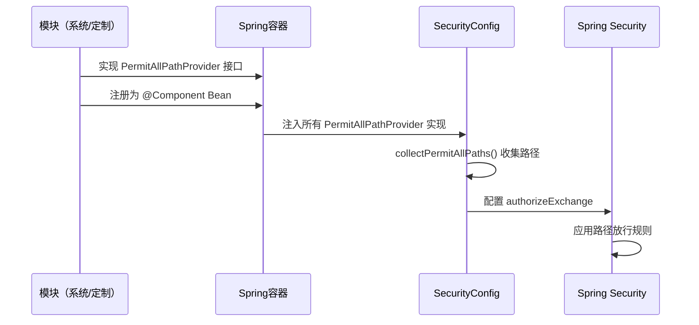

# 模块注册放行接口规范

## 核心原则

**定制模块可以通过实现 `PermitAllPathProvider` 接口注册需要放行的路径，无需修改上游 SecurityConfig 代码。所有模块（系统模块和定制模块）统一通过此接口注册路径，实现可插拔的路径配置机制。**

## 接口定义

### PermitAllPathProvider

**位置：** `backend-common-security/src/main/java/org/charno/commonsecurity/config/PermitAllPathProvider.java`

**职责：** 允许模块注册需要匿名访问的路径

**接口方法：**
```java
List<String> getPermitAllPaths();
```

**返回值说明：**
- 返回需要放行的路径列表
- 不能返回 `null`，如果不需要注册路径，返回空列表
- 支持精确路径和通配符路径

## 工作原理

### 路径收集机制

1. **自动发现**：Spring 自动收集所有实现 `PermitAllPathProvider` 接口的 Bean
2. **统一收集**：`SecurityConfig` 在启动时通过构造函数注入所有实现
3. **自动去重**：多个模块注册相同路径时，`SecurityConfig` 会自动去重
4. **统一配置**：所有收集到的路径统一配置到 Spring Security 的 `authorizeExchange` 中

### 工作流程



## 使用方式

### 1. 系统模块注册路径

系统模块（`backend-system`）通过 `ModuleInitialization` 实现接口：

**文件：** `backend-system/src/main/java/org/charno/system/ModuleInitialization.java`

```java
@Component
public class ModuleInitialization implements ApplicationRunner, PermitAllPathProvider {
    
    @Override
    public void run(ApplicationArguments args) throws Exception {
        // 系统模块初始化逻辑
    }
    
    @Override
    public List<String> getPermitAllPaths() {
        return Arrays.asList(
                "/api/login",       // 登录接口
                "/api/register"     // 注册接口
        );
    }
}
```

### 2. 定制模块注册路径

定制模块创建独立的路径提供者类：

**文件：** `backend-custom-{业务名}/src/main/java/org/charno/custom/{业务名}/config/{业务名}SecurityPathProvider.java`

```java
package org.charno.custom.wechat.config;

import org.charno.commonsecurity.config.PermitAllPathProvider;
import org.springframework.stereotype.Component;

import java.util.Arrays;
import java.util.List;

/**
 * 微信客服模块安全路径提供者
 * 注册需要放行的微信回调接口
 */
@Component
public class WechatSecurityPathProvider implements PermitAllPathProvider {
    
    @Override
    public List<String> getPermitAllPaths() {
        return Arrays.asList(
            "/api/wechat/callback",      // 微信回调接口
            "/api/wechat/verify"         // 微信验证接口
        );
    }
}
```

## 路径格式规范

### 支持的路径格式

1. **精确路径**
   - 格式：`/api/custom/callback`
   - 说明：完全匹配指定路径
   - 示例：`/api/login`、`/api/register`

2. **通配符路径**
   - 格式：`/api/custom/**`
   - 说明：匹配 `/api/custom/` 下的所有路径
   - 示例：`/api/wechat/**` 匹配 `/api/wechat/callback`、`/api/wechat/verify` 等

3. **Ant 风格路径**
   - 格式：`/api/custom/*/callback`
   - 说明：`*` 表示单个路径段，`**` 表示多个路径段
   - 示例：`/api/wechat/*/notify` 匹配 `/api/wechat/v1/notify`、`/api/wechat/v2/notify` 等

### 路径匹配规则

- Spring Security 按配置顺序匹配路径
- 精确路径优先于通配符路径
- 建议将精确路径放在通配符路径之前

## 实现示例

### 示例1：单个路径

```java
@Component
public class PaymentSecurityPathProvider implements PermitAllPathProvider {
    @Override
    public List<String> getPermitAllPaths() {
        return Collections.singletonList("/api/payment/webhook");
    }
}
```

### 示例2：多个路径

```java
@Component
public class WechatSecurityPathProvider implements PermitAllPathProvider {
    @Override
    public List<String> getPermitAllPaths() {
        return Arrays.asList(
            "/api/wechat/callback",
            "/api/wechat/verify",
            "/api/wechat/**"  // 通配符支持
        );
    }
}
```

### 示例3：结合 ApplicationRunner 动态加载

如果需要在运行时动态决定路径（例如从数据库读取），可以结合 `ApplicationRunner`：

```java
@Component
public class DynamicSecurityPathProvider implements PermitAllPathProvider, ApplicationRunner {
    
    private List<String> paths = new ArrayList<>();
    
    @Override
    public List<String> getPermitAllPaths() {
        return paths;
    }
    
    @Override
    public void run(ApplicationArguments args) {
        // 从数据库或其他配置源加载路径
        paths = loadPathsFromDatabase();
    }
    
    private List<String> loadPathsFromDatabase() {
        // TODO: 从数据库加载路径配置
        return Arrays.asList("/api/dynamic/path1", "/api/dynamic/path2");
    }
}
```

### 示例4：在模块初始化类中实现

如果模块已有 `ModuleInitialization` 类，可以直接实现接口：

```java
@Component
public class ModuleInitialization implements ApplicationRunner, PermitAllPathProvider {
    
    @Override
    public void run(ApplicationArguments args) throws Exception {
        // 模块初始化逻辑
    }
    
    @Override
    public List<String> getPermitAllPaths() {
        return Arrays.asList(
            "/api/module/callback",
            "/api/module/webhook"
        );
    }
}
```

## 注意事项

### 1. 返回值要求

- **不能返回 `null`**：如果 `getPermitAllPaths()` 返回 `null`，会被忽略并记录警告日志
- **空列表表示无路径**：如果不需要注册路径，返回 `Collections.emptyList()` 或 `new ArrayList<>()`

### 2. 路径去重

- 多个模块可能注册相同路径，`SecurityConfig` 会自动去重
- 无需担心路径重复问题

### 3. 路径顺序

- Spring Security 按配置顺序匹配路径
- 建议将精确路径放在通配符路径之前
- 通配符路径应放在列表末尾

### 4. 安全性考虑

- **谨慎注册路径**：只注册真正需要匿名访问的接口
- **避免暴露敏感接口**：不要注册包含敏感信息的接口
- **使用精确路径**：尽可能使用精确路径，避免使用过于宽泛的通配符

### 5. 异常处理

- 如果 `getPermitAllPaths()` 抛出异常，会被捕获并记录错误日志
- 异常不会影响其他模块的路径注册
- 建议在方法内部处理可能的异常

### 6. 日志记录

- `SecurityConfig` 在启动时会记录所有注册的路径（INFO 级别）
- 如果提供者返回 `null`，会记录警告日志
- 如果获取路径时发生异常，会记录错误日志

## 依赖要求

### 系统模块

系统模块（`backend-system`）已依赖 `backend-common-security`，可以直接使用接口。

### 定制模块

定制模块需要在 `pom.xml` 中添加依赖：

```xml
<dependency>
    <groupId>org.charno</groupId>
    <artifactId>backend-common-security</artifactId>
    <version>${project.version}</version>
</dependency>
```

## 检查清单

创建新的路径提供者时，请检查：

- [ ] 类实现了 `PermitAllPathProvider` 接口
- [ ] 类使用 `@Component` 或 `@Service` 注解注册为 Spring Bean
- [ ] `getPermitAllPaths()` 方法返回 `List<String>`，不能返回 `null`
- [ ] 路径格式正确（精确路径或通配符路径）
- [ ] 精确路径放在通配符路径之前
- [ ] 只注册真正需要匿名访问的接口
- [ ] 定制模块已添加 `backend-common-security` 依赖

## 优势

1. **零侵入**：上游代码只需提供接口，无需硬编码定制模块路径
2. **可扩展**：支持多个定制模块同时注册路径
3. **类型安全**：使用接口定义，编译时检查
4. **自动发现**：Spring 自动收集所有实现，无需手动注册
5. **向后兼容**：如果没有模块实现接口，行为与之前一致
6. **模块化**：每个模块管理自己的路径配置，职责清晰

## 常见问题

### Q1: 为什么需要实现 PermitAllPathProvider 接口？

**A:** 为了支持可插拔的路径配置机制，避免在上游 `SecurityConfig` 中硬编码定制模块的路径。通过接口实现，定制模块可以独立注册路径，无需修改上游代码。

### Q2: 可以在运行时动态修改路径吗？

**A:** 可以。实现 `PermitAllPathProvider` 接口并实现 `ApplicationRunner`，在 `run()` 方法中从数据库或其他配置源加载路径。但需要注意，路径在应用启动时收集，运行时修改需要重启应用才能生效。

### Q3: 多个模块注册相同路径会怎样？

**A:** `SecurityConfig` 会自动去重，相同路径只会配置一次。无需担心路径重复问题。

### Q4: 路径匹配的顺序重要吗？

**A:** 重要。Spring Security 按配置顺序匹配路径，精确路径应放在通配符路径之前，以确保匹配正确。

### Q5: 如果 getPermitAllPaths() 返回 null 会怎样？

**A:** 会被忽略并记录警告日志，不会影响其他模块的路径注册。建议始终返回非 null 的列表（可以是空列表）。

### Q6: 系统模块的路径在哪里注册？

**A:** 系统模块的路径在 `backend-system/src/main/java/org/charno/system/ModuleInitialization.java` 中通过实现 `PermitAllPathProvider` 接口注册。

## 相关文档

- [身份验证设计](./身份验证设计.md) - 了解 SecurityConfig 的工作原理
- [上下游仓库规范](./上下游仓库规范.md) - 了解模块化架构设计
- [控制层规范](./控制层规范.md) - 了解 Controller 层的开发规范

